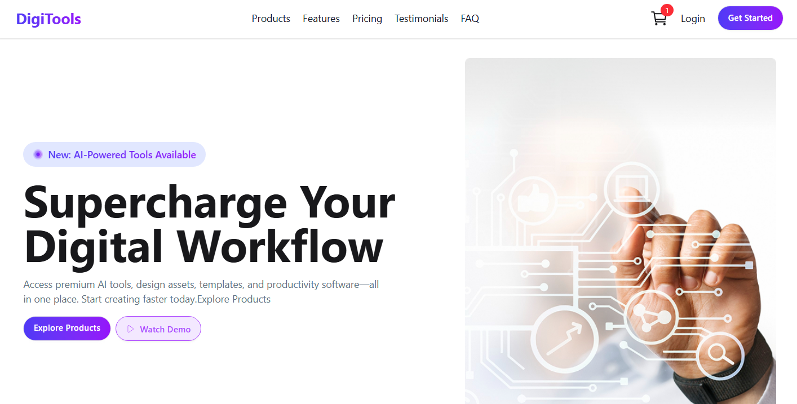
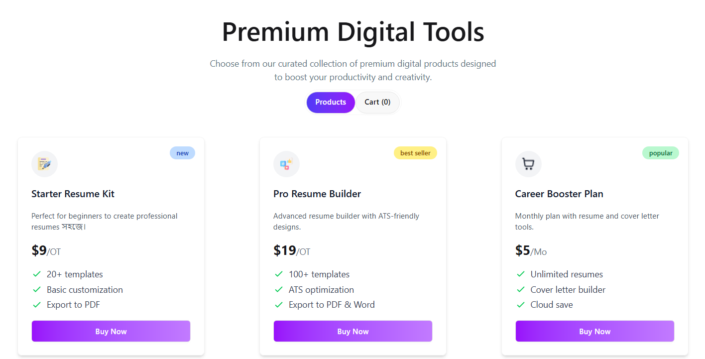
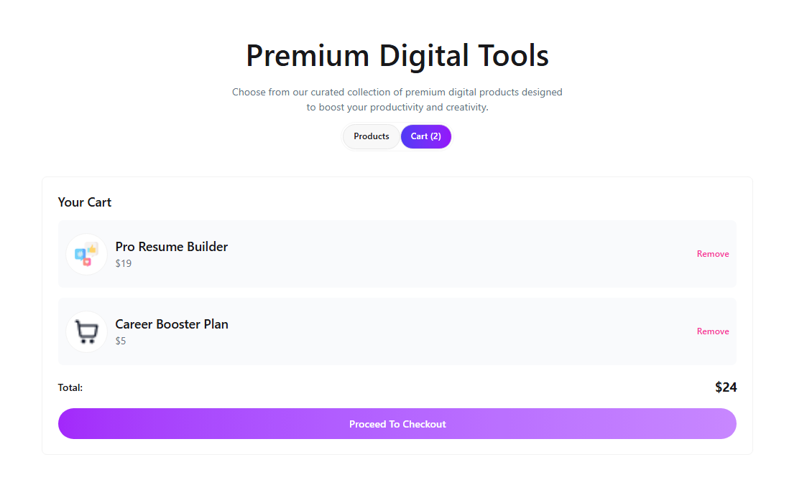
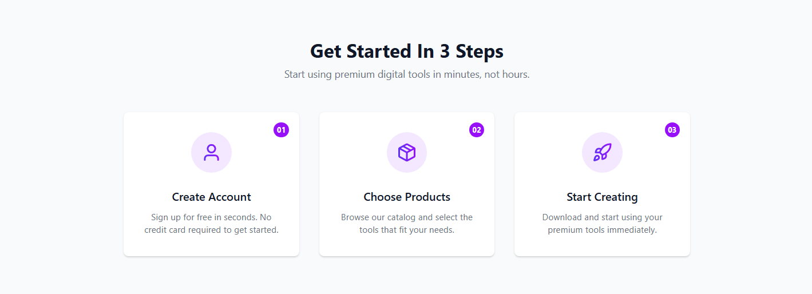
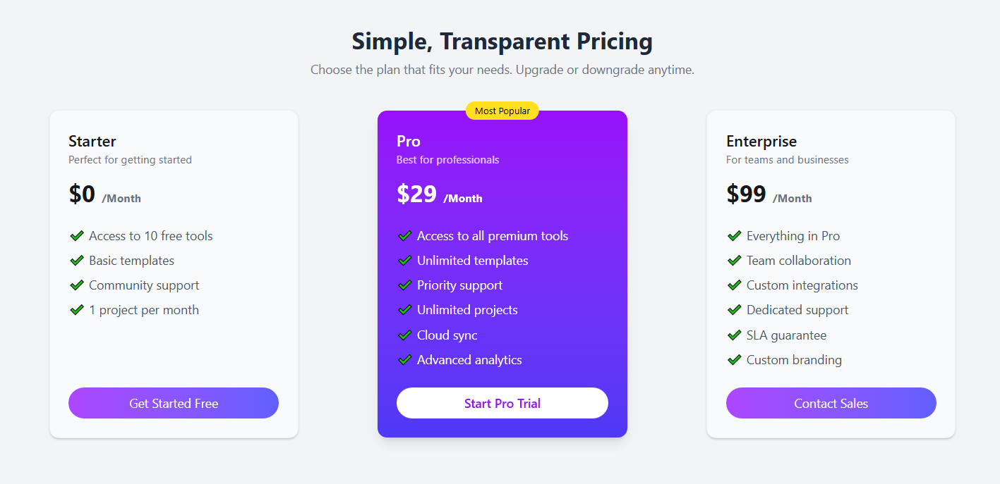
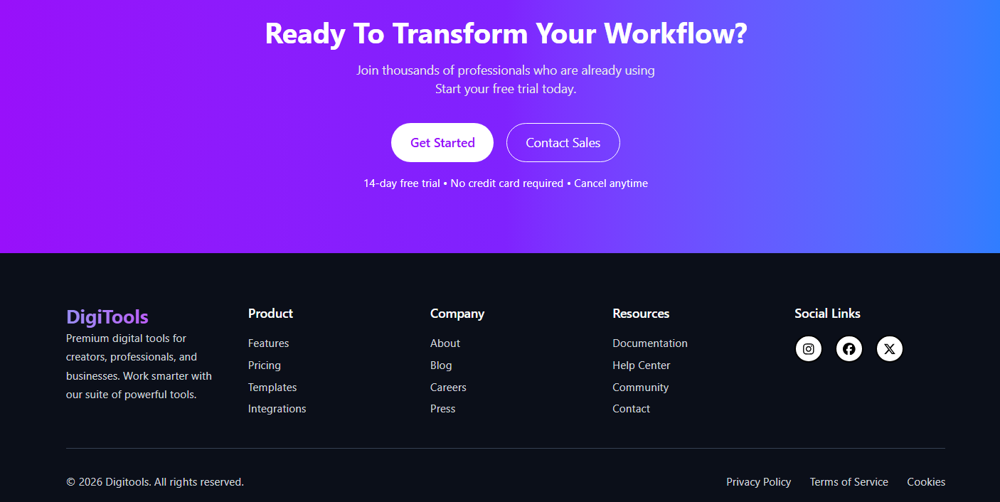

# 🌟 DigiTools



**A fully functional e-commerce demo web application** where users can browse products, add them to the cart, and manage their selections easily. Everything is interactive and fully responsive for all devices.

[🌐 Live Demo](https://transcendent-alfajores-5eb958.netlify.app/)

---

## 🖼️ Web Gallery

A showcase of different parts of the website:

<div style="display: flex; flex-wrap: wrap; gap: 20px; justify-content: center;">

 
 
 
 


</div>

*Images are scaled for better visibility and layout.*

---

## 💻 Technologies Used
- **React** – For building dynamic user interfaces  
- **Tailwind CSS** – For modern and responsive styling  
- **JavaScript** – Core programming language  
- **React Toastify** – For notifications and alerts  
- **Netlify** – Hosting the live demo  

---

## 🚀 Key Features
1. **Product Listing** – Browse products with images, names, and prices.  
2. **Add & Remove from Cart** – Easily manage your shopping cart.  
3. **Empty Cart Messages & Notifications** – Friendly messages and toast notifications.  
4. **Responsive Design** – Works perfectly on mobile, tablet, and desktop devices.  

---

## 📦 Installation

To run this project locally:

```bash
git clone https://github.com/yourusername/your-repo-name.git
cd your-repo-name
npm install
npm start